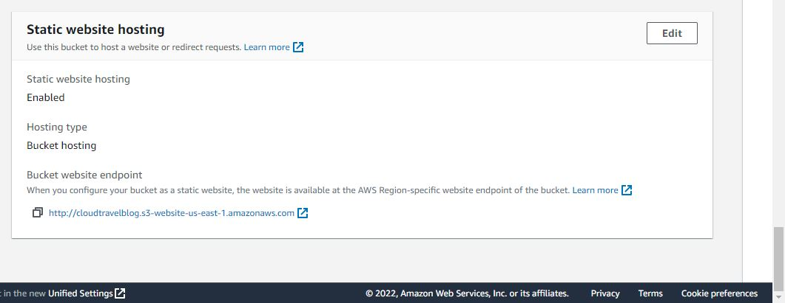
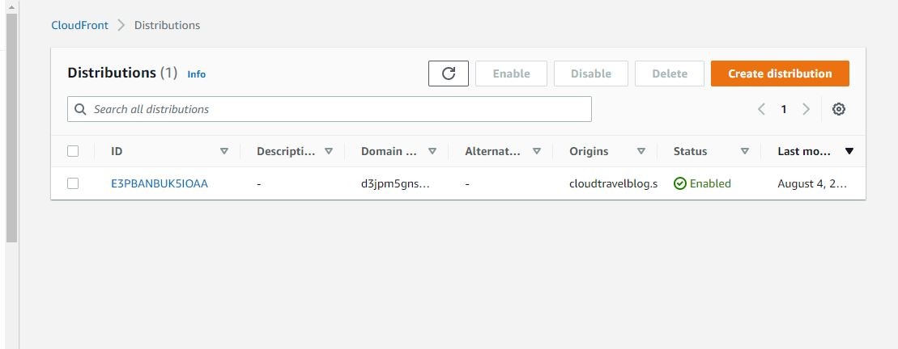

# Project 1

Hosting of static blog website using aws s3 bucket and cloudfront for distribution
S3 bucket named cloudtravelblog is created and the static sites files are uploaded to the bucket
S3 is configured for static hosting and IAM policy is created to make the bucket objects public
Cloudfront distribution is created and configured to route http to https for the bucket endpoint

<a href="http://cloudtravelblog.s3-website-us-east-1.amazonaws.com">Static Website URL </a>
  

  
 Contents 

   <ol>
    <li><a href="#Endpoints"> Site URL</a></li>
  </ol>
   <ol>
    <li><a href="#Screenshots"> Screenshots </a></li>
  </ol>
  <ol>
    <li><a href="#Static Site Files">Sites Content </a></li>
  </ol>
  

## Endpoints

  

<a href="http://cloudtravelblog.s3-website-us-east-1.amazonaws.com">S3 Bucket Host URL</a> 
<a href="https://d3jpm5gns8wifo.cloudfront.net">Cloud front distribution URL</a>
  

  
  ## Screenshots
  

  <h3> Screenshot of Created S3 Bucket</h3>
  
  

  

  <h3> Screenshot of File upload to S3 Bucket</h3>
  
  

  

  <h3> IAM Policy For bucket</h3>
  
  

  

  <h3> Configure S3 for static hosting</h3>
  
  

  

  <h3> S3 configured for static hosting</h3>
  
  

  

  <h3> Create Cloudfront distribution</h3>
  
  

  
  ## Static Site Files

<a href="udacity-starter-website">Static Website Files</a>
