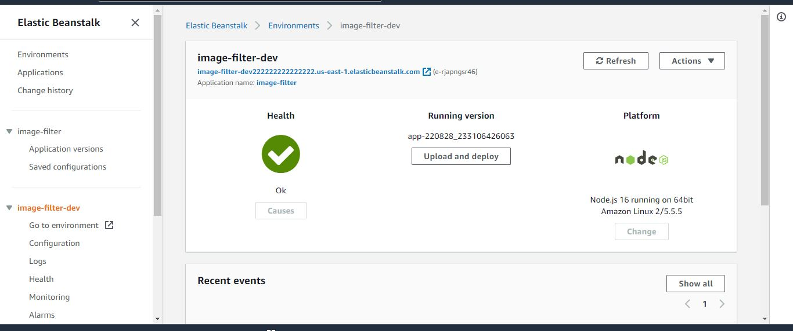
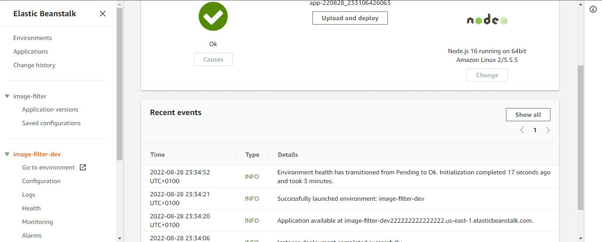
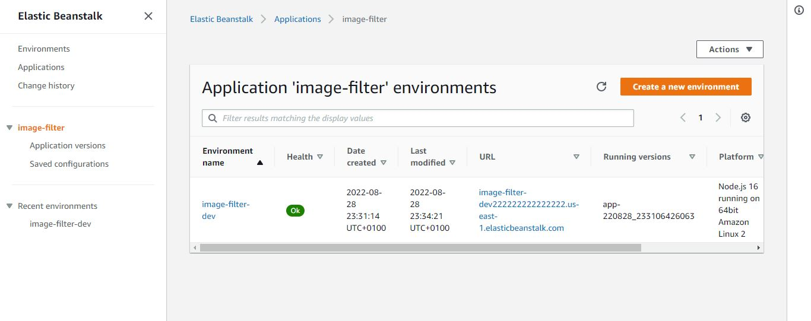

# Project 2

Rest API to load and filter image from URL. Images will be deleted once response is sent.
I make use of the finally in exceptions catching to delete after sending response

<a href="http://image-filter-dev222222222222222.us-east-1.elasticbeanstalk.com">Frontend URL</a>
  

  
 Contents 

   <ol>
    <li><a href="#Endpoints"> Site URL</a></li>
  </ol>
   <ol>
    <li><a href="#Screenshots"> Screenshots </a></li>
  </ol>
  <ol>
    <li><a href="#Other Pages">Other Pages</a></li>
  </ol>
  

## Endpoints

  

<a href="http://image-filter-dev222222222222222.us-east-1.elasticbeanstalk.com/">App URL</a> 
<a href="http://image-filter-dev222222222222222.us-east-1.elasticbeanstalk.com/filteredimage?image_url=https://images.freeimages.com/images/large-previews/3c2/little-roberto-and-vitoria-1177528.jpg">Image Filter URL</a>
<a href="http://image-filter-dev222222222222222.us-east-1.elasticbeanstalk.com/filtered">404 URL</a>
  

  
  ## Screenshots
  

  <h3> Screenshot of Elasticbean environment</h3>
  
  

  

  <h3> Screenshot of EB environment with infos </h3>
  
  

  

  <h3> Screenshot of Application</h3>
  
  

  
  

 
 ## 
  
  ## Other Pages

<a href="udacity-starter-website">Static Website Files</a>
